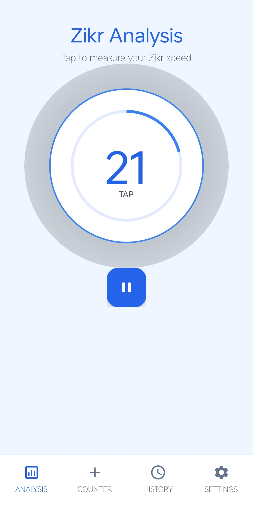
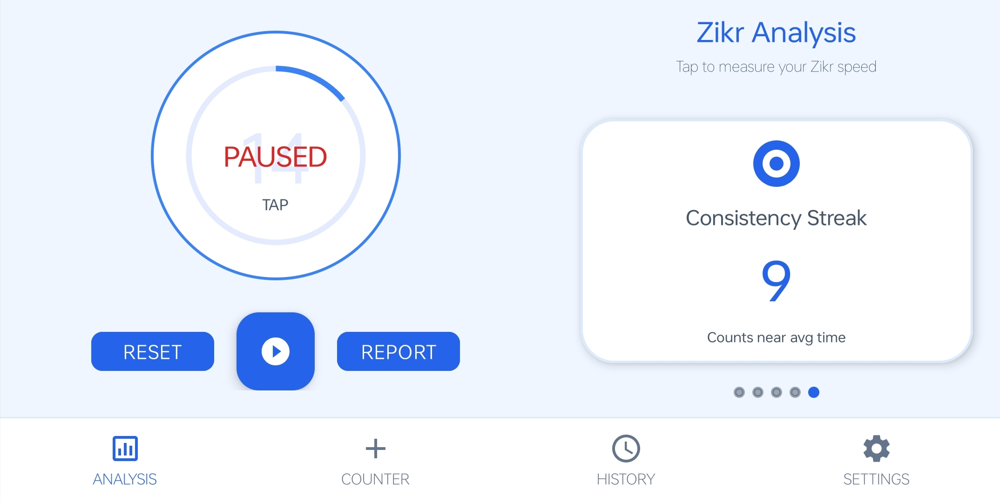
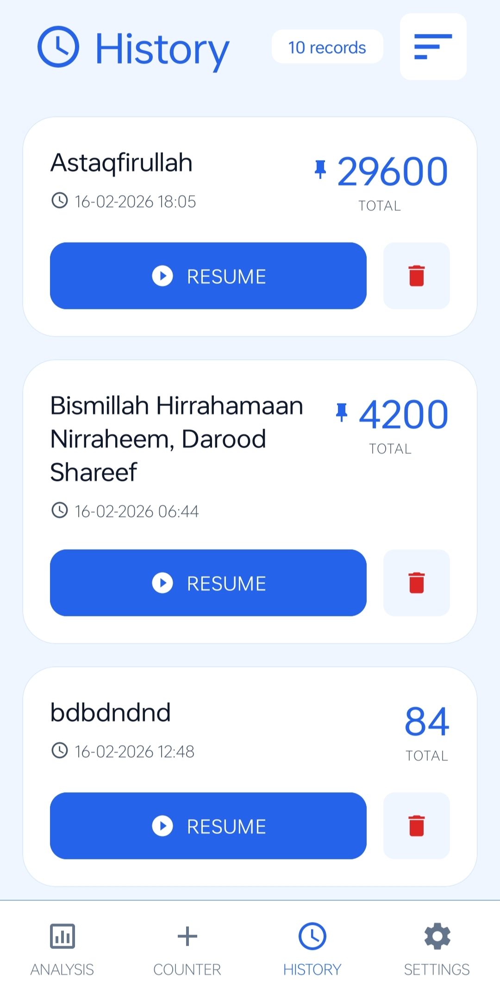
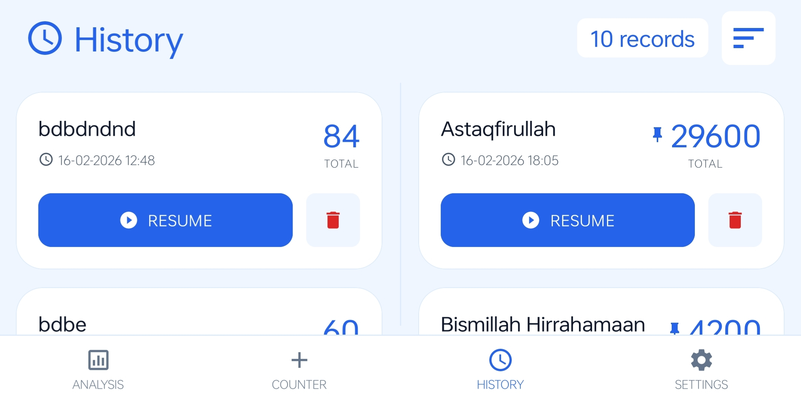
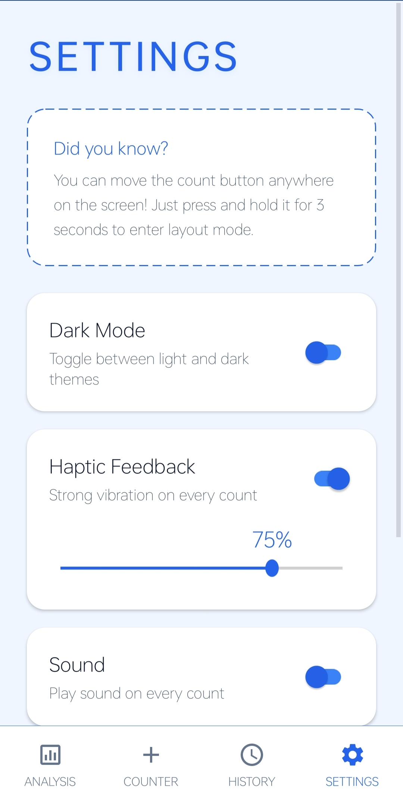
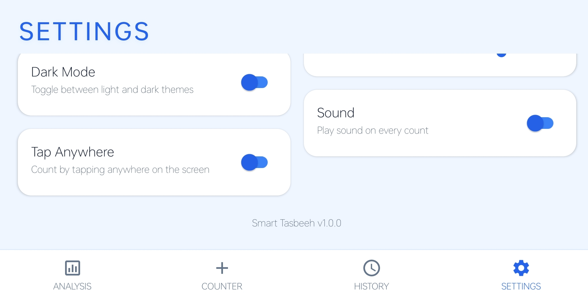

# Smart Tasbeeh 📿


**Smart Tasbeeh** is a premium, feature-rich digital counter application for Android, designed to elevate your dhikr (remembrance) and daily counting experience. It combines a stunning, modern interface with powerful tools like auto-counting, detailed analysis, and a fully responsive design for all screen sizes.

---

## 📌 App Information

- **Current Version:** v1.1.0
- **Minimum SDK:** Android 7.0 (Nougat)
- **Architecture:** MVVM
- **Last Updated:** February 2026

---

## 📥 Download APK

🔽 **Latest Version**  
[Download Smart Tasbeeh (Latest)](https://github.com/sameer021000/Smart-Tasbeeh/releases/latest)

📜 **All Versions**  
[View All Releases](https://github.com/sameer021000/Smart-Tasbeeh/releases)

> ⚠️ Enable "Install from Unknown Sources" in Android settings before installing the APK.

---

## ✨ Key Features

### 🚀 **Advanced Counting**
*   **Smart Digital Counter**: Large, responsive interface with **Integrated Word Representation** (e.g., "One Hundred") displayed below the digit.
*   **Action Labels**: Every button features a clear text label (SAVE, RESET, etc.) for an intuitive, zero-learning-curve experience.
*   **Auto-Count Mode**: Hands-free counting with a dual-range speed slider (**0.3s to 60.0s**). Ideal for both rapid and meditative pacing.
*   **Tap Anywhere**: Option to increment the count by tapping any part of the screen.

### 🎯 **Goals & Tracking**
*   **Target Mode**: Set specific goals. The app notifies you with vibration and dialogs when targets are reached.
*   **Dashboard History**: Automatically save sessions. A redesigned management screen with a **Record Count Badge**, pin support (up to 3), and **Advanced Sorting** (Date, Count, Title).
*   **Update Comparison**: When resuming a zikr, view a side-by-side comparison of your "Old Saved Count" and "Current New Count."
*   **Smart Analysis**: Visualize your performance and consistency with built-in charts and statistics.

### 🎨 **Premium UI/UX**
*   **Responsive Landscape Mode**: A dedicated split-screen layout optimized for tablets and foldable devices, ensuring a perfect experience in any orientation.
*   **Fluid Text Scaling**: Dynamic typography that calculates size based on screen width, ensuring a premium look on phones, tablets, and foldables.
*   **Modern Aesthetics**: Features glassmorphism, smooth animations, and clean Material Design. Includes **icon-based toggles** for Sound and Vibration controls.
*   **Dark Mode**: Fully supported system-wide dark mode for comfortable night use.
*   **Rich Feedback**: satisfying click sounds and customizable vibration (haptic) strength.

---

## 📱 Screenshots

|                          Portrait Mode                           |                           Landscape Mode                            |
|:----------------------------------------------------------------:|:-------------------------------------------------------------------:|
|    |    |
|   |   |
|    |    |
|   |   |

---

## 🛠️ Tech Stack

*   **Language**: Java
*   **UI**: Android XML Layouts (ConstraintLayout, Material Components)
*   **Architecture**: MVVM Pattern
*   **Persistence**: SharedPreferences & SQLite (DbHelper)
*   **Compatibility**: Android 7.0 (Nougat) and above

---

## 📥 Installation

1.  **Clone the repository:**
    ```bash
    git clone https://github.com/sameer021000/Smart-Tasbeeh.git
    ```
2.  **Open in Android Studio**:
    *   File > Open > Select the cloned directory.
3.  **Build & Run**:
    *   Sync Gradle files.
    *   Run on an emulator or physical Android device.