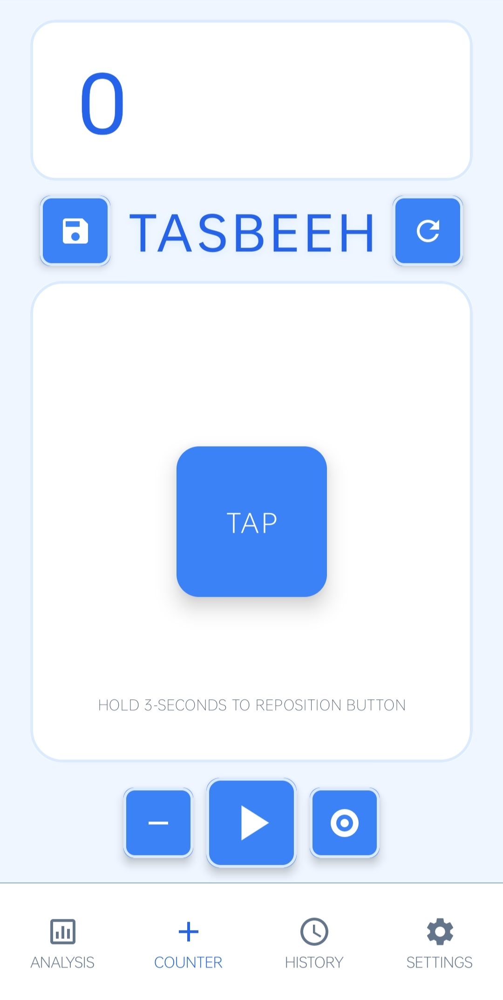
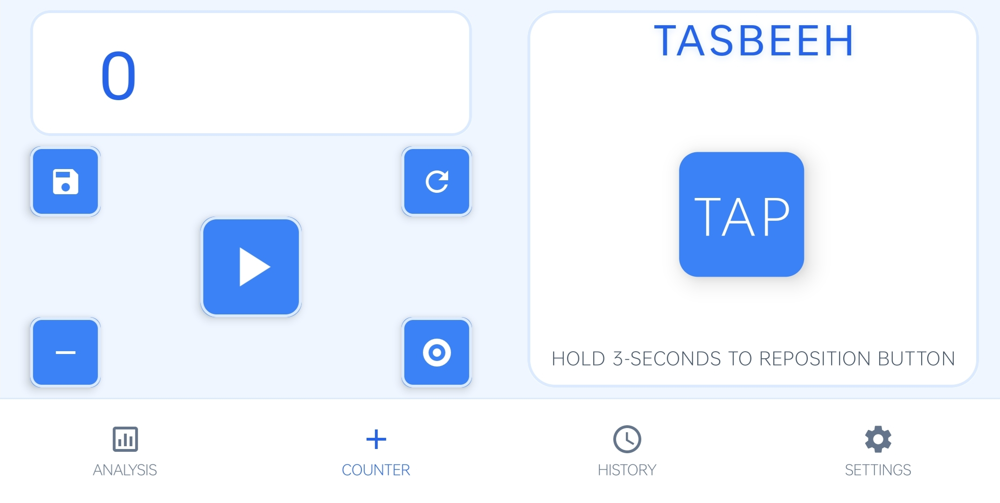

# Smart Tasbeeh 📿

**Smart Tasbeeh** is a premium, feature-rich digital counter application for Android, designed to elevate your dhikr (remembrance) and daily counting experience. It combines a stunning, modern interface with powerful tools like auto-counting, detailed analysis, and a fully responsive design for all screen sizes.

## ✨ Key Features

### 🚀 **Advanced Counting**
*   **Digital Counter**: Large, responsive, and easy-to-tap interface.
*   **Auto-Count Mode**: Hands-free counting with adjustable speed (0.1s to 5s+). Ideal for consistent pacing.
*   **Tap Anywhere**: Option to increment the count by tapping any part of the screen.
*   **Hardware Buttons**: Use volume keys to count, allowing for tactile feedback without looking at the screen.

### 🎯 **Goals & Tracking**
*   **Target Mode**: Set specific goals. The app notifies you with vibration and dialogs when targets are reached.
*   **History & Pinning**: Automatically save sessions with dates/times. **Pin** your most important counts to the top and **sort** history by date or count value.
*   **Smart Analysis**: Visualize your performance and consistency with built-in charts and statistics.

### 🎨 **Premium UI/UX**
*   **Responsive Landscape Mode**: A dedicated split-screen layout optimized for tablets and foldable devices, ensuring a perfect experience in any orientation.
*   **Modern Aesthetics**: Features glassmorphism, smooth animations, and a clean Material Design interface.
*   **Dark Mode**: Fully supported system-wide dark mode for comfortable night use.
*   **Rich Feedback**: satisfying click sounds and customizable vibration (haptic) feedback.

## 📱 Screenshots

|                         Portrait Mode                          |                                                     Landscape Mode                                                      | Analysis & History |
|:--------------------------------------------------------------:|:-----------------------------------------------------------------------------------------------------------------------:|:---:|
|  | (screenshots/analysis_screen_lighttheme_landscape.jpg) |  |

## 🛠️ Tech Stack

*   **Language**: Java
*   **UI**: Android XML Layouts (ConstraintLayout, Material Components)
*   **Architecture**: MVVM Pattern
*   **Persistence**: SharedPreferences & SQLite (DbHelper)
*   **Compatibility**: Android 7.0 (Nougat) and above

## 📥 Installation

1.  **Clone the repository:**
    ```bash
    git clone https://github.com/sameer021000/Smart-Tasbeeh.git
    ```
2.  **Open in Android Studio**:
    *   File > Open > Select the cloned directory.
3.  **Build & Run**:
    *   Sync Gradle files.
    *   Run on an emulator or physical Android device.